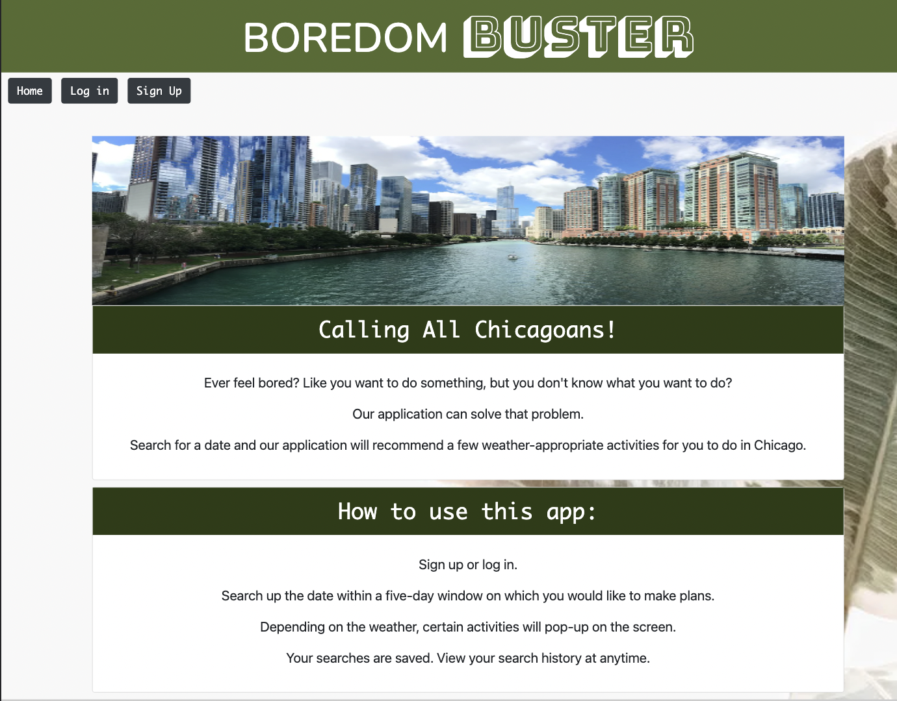
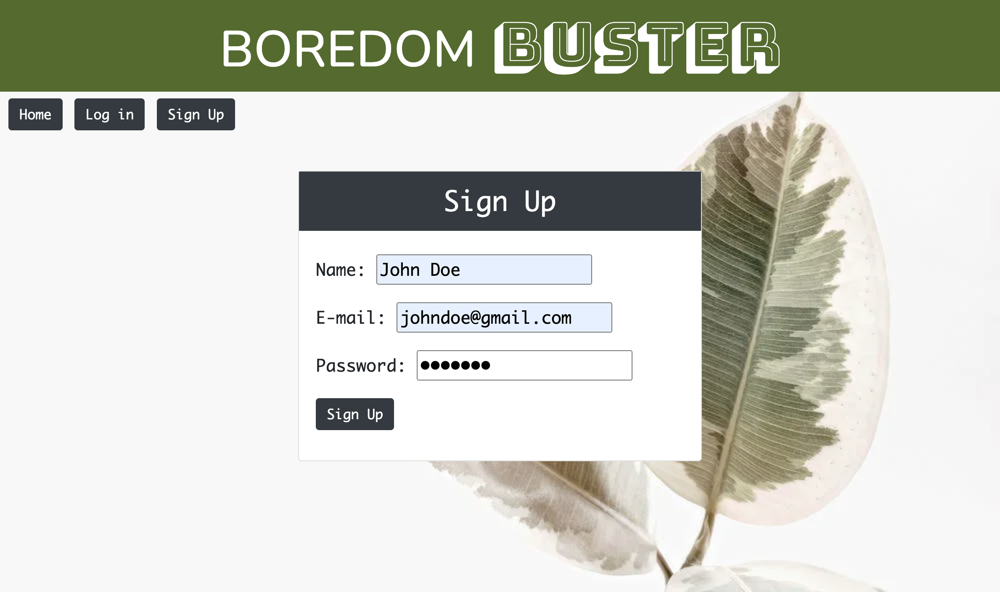
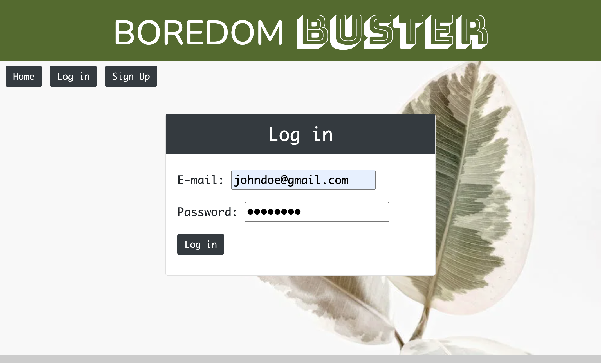
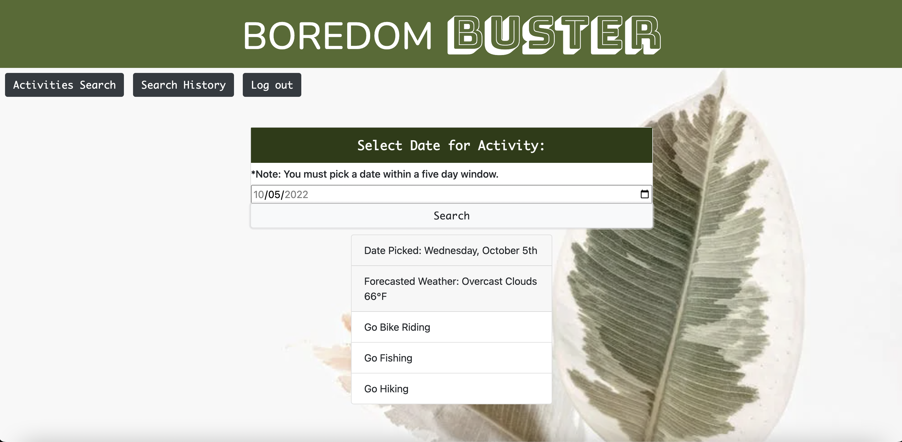
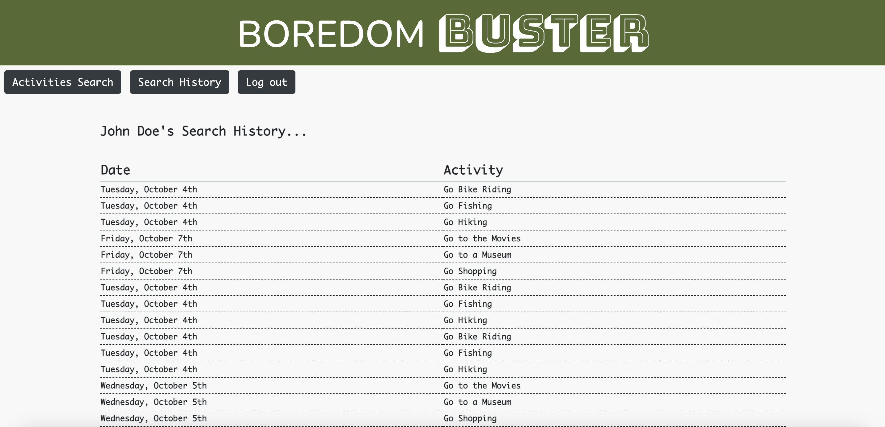

# Boredom Buster

# Description
Ever feel bored, like you want to do something, but you don't know what you want to do? Our application can solve that problem. 
Search for a date and the application will recommend a few activities based on the weather for you to do.

# User Story 
Once a user loads up the page, a description of the application is displayed. A user has the option to sign up or log in. 

Upon clicking the SIGN UP button, the user is prompted to enter name, email address, and a password (minimum of 8 characters). 
Upon clicking the LOGIN button, the user is prompted to enter email address and password. 

Once logged on, the user is taken to the ACTIVITIES SEARCH page. The user can choose a date within a 5 day window. Depending on the weather, certain activities will pop-up on the screen along with the temperature and weather. Users search histories are automatically saved. 

A user can access search history by clicking the SEARCH HISTORY button. Users can also log out at any time.

# Screenshots

# Technologies Used
* CSS/Bootstrap
* Javascript
* Node.js 
* Express.js 
* Handlebars.js 
* MySQL 
* Sequelize ORM 
* GET/POST routes
* Heroku
* Postgres DB
* Axios
* Ajax

# Future Development

* Clear Search history.
* Link to event on Activities page and History page.
* Change login and signup pages to modals.
* Restrict Select Date for Activity to only the available dates.
* Add featured activities to the home and Activities Search pages.
* Add about page with team members portfolio links.
* Add a link to the header to return to the home page.
* Add forecast, the company holding the event and the event links to each item in the search history.
* Expand to beyond Chicago

# Links
Deployed URL - https://boredom-buster.herokuapp.com/

GitHub Repo - https://github.com/kthomasnj/Activity-Planner-Weather

Link to Presentation - https://docs.google.com/presentation/d/1z-eNxhkW3EPca5VdxEQrQ94NS0J0RCnzsk1SsI_sbQk/
